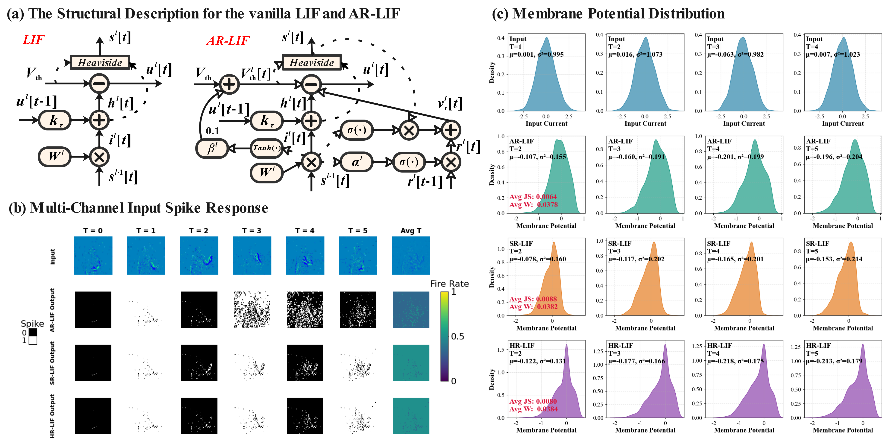

# AR-LIF: Adaptive Reset Leaky Integrate-and-Fire Neuron for Spiking Neural Networks

This is the official Pytorch implementation of the paper:

[AR-LIF: Adaptive Reset Leaky Integrate-and-Fire Neuron for Spiking Neural Networks](https://arxiv.org/abs/2507.20746)

## Dependencies
- Python 3
- PyTorch, torchvision
- spikingjelly 0.0.0.0.12
- Python packages: `pip install tqdm progress torchtoolbox thop`

## Training
Experiments on the CIFAR10-DVS dataset are implemented based on the [PSN](https://github.com/fangwei123456/Parallel-Spiking-Neuron) code; for details, please refer to the AR-LIF-PSN folder. All other experiments are implemented in the AR-LIF folder. These two folders should be regarded as two separate projects, and the following instructions are for the AR-LIF folder. Records of the training process can be found in the ./logs folder.

    # CIFAR-10
	python ./train.py -data_dir ./data_dir -dataset cifar10 -model spiking_resnet18 -T 4 -b 128 -T_max 400 -epochs 400 -weight_decay 5e-5 -neuron XLIF -cutupmix_auto
    
    # CIFAR-100
    python ./train.py -data_dir ./data_dir -dataset cifar10 -model spiking_resnet18 -T 4 -b 128 -T_max 400 -epochs 400 -neuron XLIF -cutupmix_auto
    
    # Tiny-Imagenet
    python ./train.py -data_dir ./data_dir -dataset tiny_imagenet -model vggsnn -T 4 -b 128 -T_max 200 -epochs 200 -neuron XLIF -cutupmix_auto -j 16 -loss_lambda 0.2 -mse_n_reg
       
    # DVS-CIFAR10 (example)
	python ./train.py -data_dir ./data_dir -dataset DVSCIFAR10 -T 4 -drop_rate 0.3 -model spiking_vgg11_bn -lr 0.05 -mse_n_reg -neuron XLIF
	
	# DVS-Gesture
    python ./train.py -data_dir ./data_dir -dataset dvsgesture -model spiking_vgg11_bn -T 20 -b 12 -drop_rate 0.4 -T_max 200 -epochs 200 -neuron XLIF

## Inference

    # example:
    python inference.py -data_dir ./data_dir -dataset tiny_imagenet -model spiking_vgg13_bn -b 256 -T 4 -neuron XLIF 
    -resume ./checkpoint_max.pth

## Acknowlegement

The code of this work is implemented based on the following codes. Special thanks are extended to them for their help and support in the implementation of the code for this work.

[SpikingJelly](https://github.com/fangwei123456/spikingjelly), [Complementary-LIF](https://github.com/HuuYuLong/Complementary-LIF), [Parallel Spiking Neuron](https://github.com/fangwei123456/Parallel-Spiking-Neuron), [Spike-driven Incepformer](https://github.com/2ephyrus/SDIncepformer)
